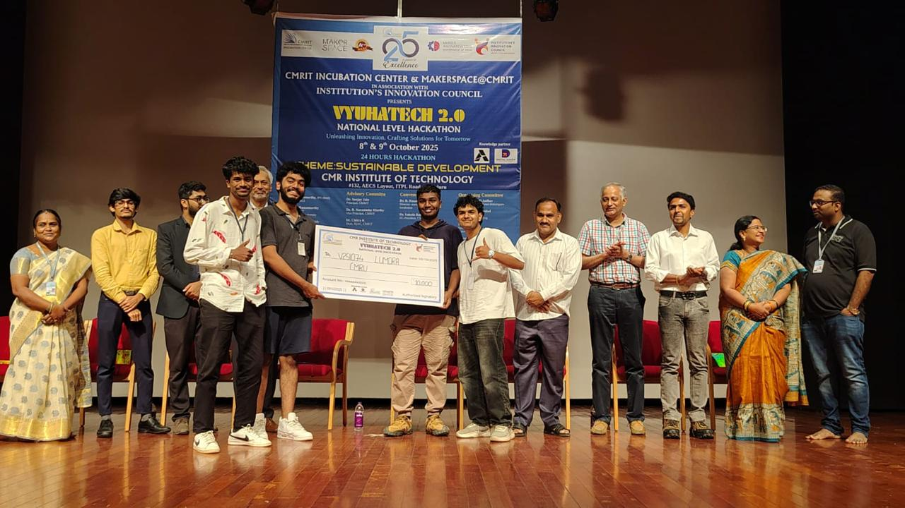

# Lumora



**Won 1st place in a national level hackathon organized by CMRIT.**

Lumora is a real-time geopolitical intelligence dashboard built for fast situational awareness, evidence-first analysis, and live monitoring across global security, infrastructure, markets, aviation, and conflict signals.

## Overview

Lumora brings together live news, strategic map layers, country instability signals, military activity, infrastructure disruptions, market movement, and AI-assisted reasoning into one unified interface. It is designed to help users move quickly from raw information to actionable understanding.

## Key Features

- Real-time global news aggregation and clustering
- AI Insights for high-level brief generation
- Investigation Agent for question-driven evidence-backed analysis
- Watchtower Agent for convergence monitoring and escalation scanning
- Live Intelligence feed for topic-based intelligence tracking
- Military flights and vessel monitoring
- Internet outage, GPS jamming, wildfire, maritime, and disruption tracking
- Country instability and focal-point detection
- Live webcam and live channel monitoring
- Multi-panel intelligence workspace with map-first navigation

## AI Layer

Lumora uses additive AI features on top of its existing intelligence pipeline.

- `AI Insights` summarizes the most important current developments
- `Investigation Agent` gathers evidence from the loaded Lumora context and generates a structured answer
- `Watchtower Agent` scans for signal convergence and surfaces emerging watch items or active alerts
- `Deduction` and country-intelligence routes support evidence-backed geopolitical analysis

The project supports cloud and local model/provider setups, including Groq-backed reasoning flows where configured.

## Tech Stack

- Frontend: TypeScript, Vite, Preact-style architecture
- Visualization: Deck.gl, MapLibre, Globe.gl
- Backend routes: local Vite middleware + server handlers
- AI/ML: Groq, browser ML workers, local/runtime-configurable providers
- Desktop support: Tauri

## Project Structure

```text
src/        Frontend app, components, services, agents, map layers
server/     Handler implementations for intelligence and data routes
api/        API route entry points
tests/      Service, route, and integration tests
src-tauri/  Desktop runtime packaging and sidecar support
```

## Running Locally

### 1. Open the project

```bash
cd /Users/sai-12/Desktop/Lumora
```

### 2. Install dependencies

```bash
npm install --legacy-peer-deps
```

### 3. Add environment variables

Create a local env file:

```bash
touch .env.local
```

Add your Groq key:

```env
GROQ_API_KEY=your_groq_api_key_here
```

### 4. Start the app

```bash
npm run dev
```

Open:

[http://127.0.0.1:3000/](http://127.0.0.1:3000/)

## Useful Commands

```bash
npm run dev
npm run typecheck
npm run build
npm run dev:tech
npm run dev:finance
npm run dev:happy
```

## Notes

- `.env.local` is ignored by Git, so local API keys stay private
- Some live data sources require additional provider keys or relays
- If local dev shows stale content, hard refresh the browser with `Cmd + Shift + R`

## Repository

GitHub:

[https://github.com/Sathya-Gynan05/Lumora-Final](https://github.com/Sathya-Gynan05/Lumora-Final)
